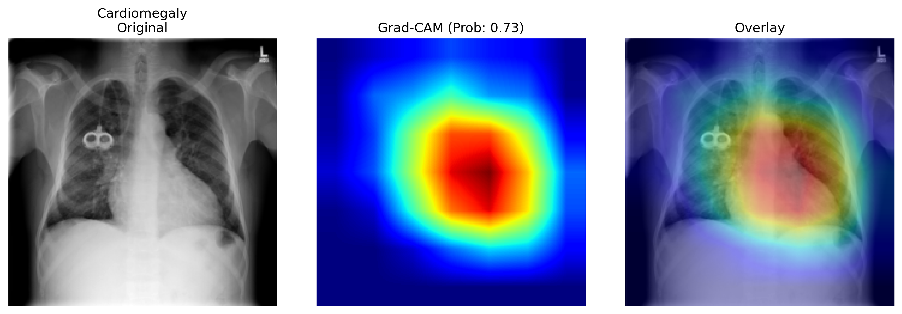
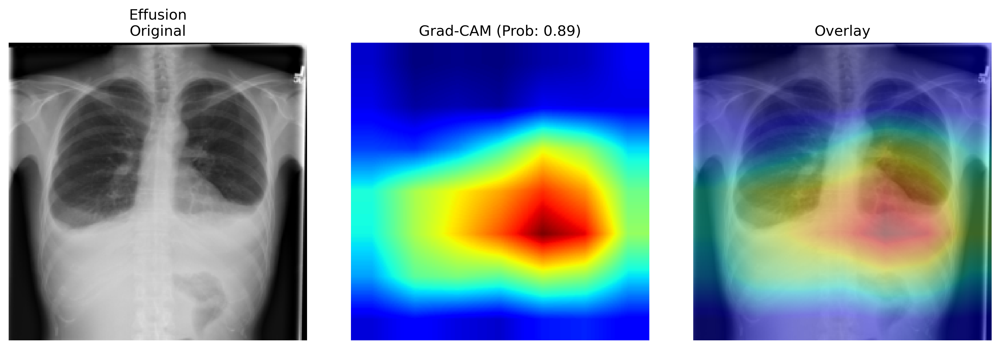
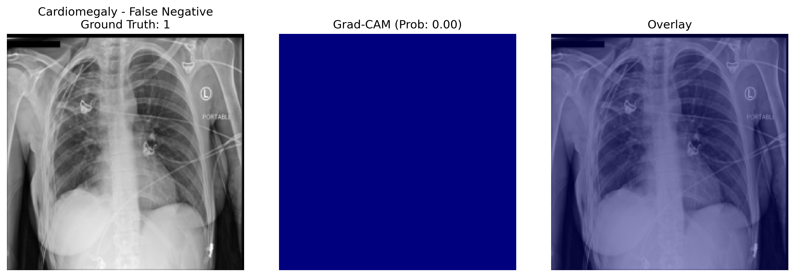
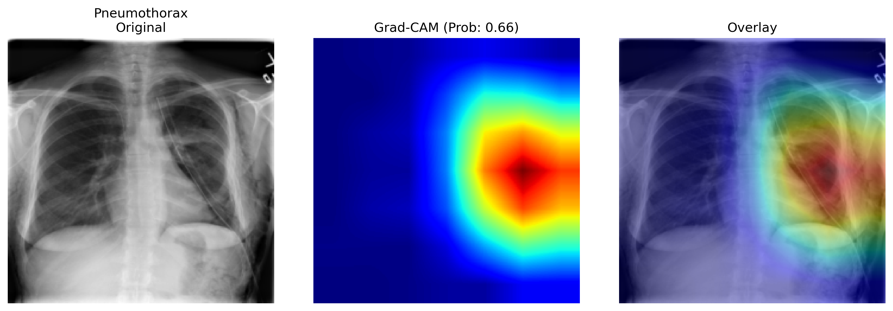
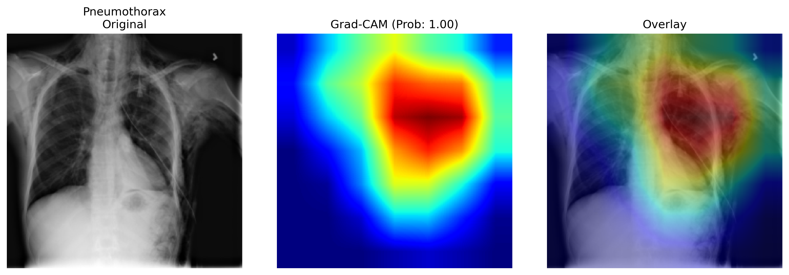

# Multi-Label Chest X-Ray Classification on NIH ChestX-ray14

Interpretable deep learning pipeline for multi-label thoracic disease classification using DenseNet121, with Grad-CAM-based explainability and a documented class-imbalance study.

## Clinical Motivation

Chest X-rays are the most commonly performed diagnostic imaging exam worldwide, but interpretation is time-consuming and subject to inter-radiologist variability. An automated triage system that flags likely findings — and shows where in the image it is looking — could help prioritize urgent cases and act as a second reader.

This project builds such a pipeline on the NIH ChestX-ray14 dataset and evaluates not only classification performance, but also model behavior through Grad-CAM visualizations and error analysis. Since a clinically deployed model needs both predictive performance and interpretability, both aspects are documented explicitly.

## Dataset

- **Source:** NIH ChestX-ray14 (112,120 frontal-view chest X-rays from 30,805 unique patients with 14 thoracic disease labels).
- **Official split:** Used NIH's provided `train_val_list.txt` and `test_list.txt` rather than creating a random train/test split.
- **Patient-wise validation:** The training portion was further divided into train and validation sets using unique patient IDs, preventing patient-level leakage.
- **Leakage check:** An explicit assertion verified zero patient overlap between train and validation.

**Final dataset sizes:**

| Split | Images |
|---|---|
| Train | 77,988 |
| Validation | 8,536 |
| Test | 25,596 |

## Model & Training

**Architecture:** DenseNet121 pretrained on ImageNet with a custom classification head:
`Linear(1024 → 256) → ReLU → Dropout(0.5) → Linear(256 → 14)`

**Loss function:** Multi-label classification was trained using `BCEWithLogitsLoss`, with independent sigmoid outputs for each disease.

**Data processing:** Resize to 224×224, ImageNet normalization, random horizontal flip, random rotation (±10°). Augmentations were applied only to the training set.

**Training strategy** — three stages:

- **Stage 1 — Frozen Backbone:** DenseNet features frozen, train classifier head only, Adam (1e-4), 20 epochs, best checkpoint selected using validation loss.
- **Stage 2 — Full Fine-Tuning:** Entire network unfrozen, differential learning rates (features: 1e-5, classifier: 1e-4), 5 epochs.
- **Stage 3 — Continued Fine-Tuning:** Entire network trainable, Adam (1e-5), additional 5 epochs.

## Results

Evaluation was performed on the official NIH test split containing 25,596 unseen images.

| Disease | AUROC |
|---|---|
| Emphysema | 0.889 |
| Hernia | 0.877 |
| Cardiomegaly | 0.862 |
| Pneumothorax | 0.846 |
| Edema | 0.834 |
| Effusion | 0.818 |
| Fibrosis | 0.780 |
| Mass | 0.778 |
| Atelectasis | 0.755 |
| Pleural_Thickening | 0.738 |
| Nodule | 0.730 |
| Consolidation | 0.722 |
| Infiltration | 0.700 |
| Pneumonia | 0.699 |
| **Macro AUROC** | **0.788** |

### Comparison with CheXNet

| Model | Dataset | Split | Macro AUROC |
|---|---|---|---|
| CheXNet (Rajpurkar et al., 2017) | NIH ChestX-ray14 | Random patient split | 0.841 |
| This work | NIH ChestX-ray14 | Official NIH split + patient-wise validation | 0.788 |

These results are not directly comparable because the evaluation protocols differ. The table is provided for context rather than as a leaderboard comparison.

### Why AUROC Instead of Accuracy?

Disease prevalence in ChestX-ray14 is highly imbalanced (e.g., Infiltration has nearly 20,000 positive examples while Hernia has only a few hundred). A model that predicts "negative" for every image would achieve deceptively high accuracy while being clinically useless. AUROC is threshold-independent and substantially less sensitive to class imbalance, making it a more appropriate metric for diagnostic classification.

### Observed Pattern

Performance appears to correlate more strongly with visual distinctiveness than with disease frequency. High-performing classes such as Hernia, Emphysema, and Cardiomegaly have relatively characteristic radiographic appearances. Lower-performing classes such as Pneumonia and Infiltration often present as diffuse, low-contrast opacities that overlap visually with other findings. This pattern is also reported in CheXNet and likely reflects genuine diagnostic difficulty rather than a flaw in the implementation.

## Experiments

### Experiment 1 — Transfer Learning Strategy

| Configuration | Macro AUROC |
|---|---|
| Frozen DenseNet121 | 0.739 |
| Full Fine-Tuning | 0.788 |

**Hypothesis:** ImageNet features transfer reasonably well to chest radiographs, but further improvement should be possible once the convolutional backbone adapts to radiographic image characteristics.

**Result:** Full fine-tuning improved macro AUROC by approximately 5 percentage points.

**Conclusion:** ImageNet pretraining provides a strong starting point, but substantial performance is unlocked once the backbone learns domain-specific radiographic features.

### Experiment 2 — Class-Imbalance Mitigation

| Configuration | Macro AUROC |
|---|---|
| Unweighted BCE | 0.788 |
| Weighted BCE (`pos_weight`) | 0.784 |

**Hypothesis:** Rare classes such as Pneumonia, Hernia, and Fibrosis would benefit from inverse-frequency weighting.

**Result:** The weighted-loss model produced essentially the same overall performance and did not consistently improve the targeted classes.

**Conclusion:** Class imbalance does not appear to be the primary bottleneck. Lower-performing diseases such as Pneumonia and Infiltration are likely limited more by intrinsic visual ambiguity than by sample frequency.

### Unexpected Observation: Explainability Regression

Although weighted BCE achieved a similar macro AUROC, Grad-CAM visualizations became less anatomically plausible for several classes. For example:

- Pneumothorax localization shifted from the lung periphery toward the mediastinum.
- Infiltration activations became less symmetric and more concentrated in a single lung.

This suggests that loss reweighting can alter how a model arrives at a prediction even when overall classification metrics remain largely unchanged. For this reason, the unweighted model is retained as the primary model in this repository.

## Explainability: Grad-CAM

Grad-CAM was implemented from scratch using forward and backward hooks attached to `model.features.denseblock4`, rather than relying on an external visualization library. The method generates class-specific heatmaps showing which image regions most influenced a prediction.

### Successful Localization

For diseases with clear anatomical targets, Grad-CAM frequently highlighted clinically relevant regions: Cardiomegaly → heart silhouette, Edema → central/perihilar lung regions, Effusion → lower lung bases.

*Figure 1: Correct Cardiomegaly prediction (primary, unweighted model) — heatmap tightly localized on the heart, as expected.*

*Figure 2: Correct Effusion prediction (Prob 0.89) — heatmap sits over the right lower lung base, consistent with fluid accumulation, though leaning to one side rather than showing the fully bilateral pattern effusion can present with.*

### Failure Cases

Rather than showing only successful examples, the repository also includes representative failure cases.

**False Negative: Cardiomegaly**

The model fails to activate meaningfully anywhere in the image, producing an almost completely flat heatmap. This suggests not incorrect localization, but an absence of discriminative signal altogether. Notably, this differs from how the *weighted* model failed on the same case — that version activated on a support-device marking in the image corner rather than the heart. Reweighting turned a "silent" failure into a "confidently wrong" one, which is arguably a worse outcome from an interpretability standpoint even though the heatmap "does something."

*Figure 3: Cardiomegaly false negative (primary model) — the heatmap is flat, with no meaningful activation anywhere.*

**Weighted vs. Unweighted Comparison**

For Pneumothorax, the unweighted model localizes attention to the lung periphery, while the weighted model shifts activation toward the mediastinum despite producing the correct classification.

| Unweighted Model (correct region) | Weighted Model (shifted to mediastinum) |
|---|---|
|  |  |

*Figure 4: Pneumothorax Grad-CAM comparison — unweighted (left) vs. weighted (right).*

### Limitations of Grad-CAM

These visualizations are qualitative examples and should not be interpreted as rigorous localization evaluation. ChestX-ray14 includes bounding-box annotations for eight diseases. A more rigorous analysis would compare heatmaps against these annotations using localization metrics such as Intersection-over-Union (IoU) and Pointing Game Accuracy. This remains future work.

## Limitations

- CheXNet comparison uses a different evaluation protocol and should not be treated as a direct benchmark.
- No learning-rate scheduling was used.
- Fine-tuning stages were run for fixed durations rather than data-driven stopping criteria.
- Grad-CAM resolution is inherently limited by DenseNet121's final feature-map size.
- ChestX-ray14 labels are automatically extracted from radiology reports and contain label noise.

## Future Work

- Quantitative Grad-CAM validation using NIH bounding-box annotations.
- Learning-rate scheduling (`ReduceLROnPlateau`) and longer fine-tuning.
- Investigate why weighted BCE degrades Grad-CAM localization despite similar AUROC.
- Explore focal loss and alternative imbalance-handling strategies.
- Compare DenseNet121 against more recent medical imaging architectures.

## References

- Wang et al. (2017). *ChestX-ray8: Hospital-scale Chest X-ray Database and Benchmarks on Weakly-Supervised Classification and Localization of Common Thorax Diseases.*
- Rajpurkar et al. (2017). *CheXNet: Radiologist-Level Pneumonia Detection on Chest X-Rays with Deep Learning.*
- Selvaraju et al. (2017). *Grad-CAM: Visual Explanations from Deep Networks via Gradient-based Localization.*
